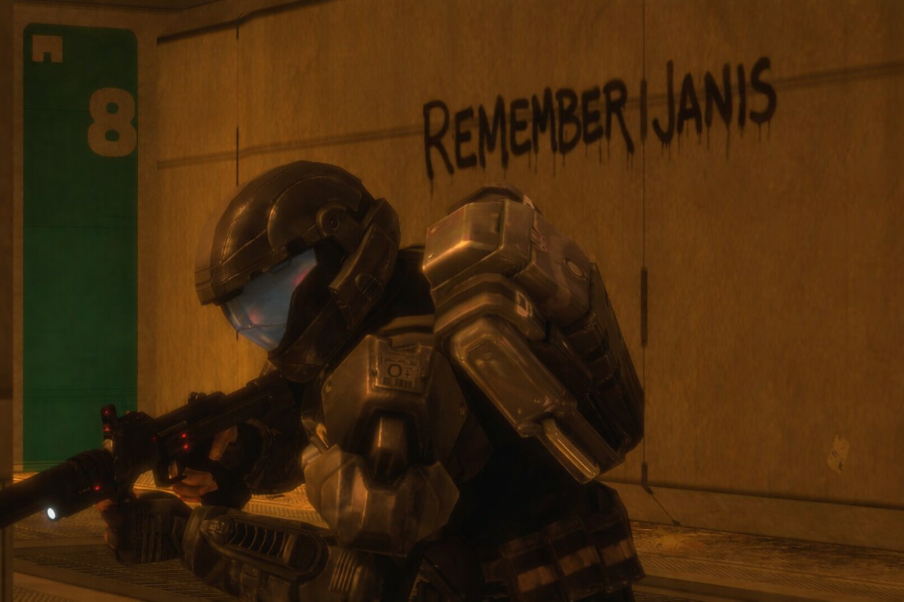

Janis showed quiet courage when it mattered most. In a single moment, he chose responsibility over fear and protected others without hesitation. His act was simple, selfless, and profoundly human — the kind of bravery that stays in memory long after the danger is gone.
